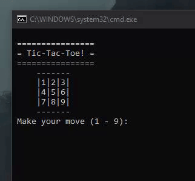

## Description
- This is a simple TicTacToe game with the purpose of getting to know Python.
- '\_\_main\_\_' module should be 'tictactoe.py'.
- A Python interpreter compatible with Python 3.9.7 is required.

## Technical Data
- Author: Eivind Hobrad Naasen
- Date: February 9th, 2022.
- Language: Python 3.9.7

## Preview 

## Debugging
- Make sure all project files are located in the same directory.
- If your default version is wrong, check your user/system variable 'Path' at environment variables.  
      Edit/create the variable at system/user level, and add both:  
      (1) %USERPROFILE%\AppData\Local\Programs\Python\Python39         (Executable for interpreter)  
      (2) %USERPROFILE%\AppData\Local\Programs\Python\Python39\Scripts (Scripts for tools such as pip)  
- Make sure you have a compatible version installed by writing "py --list" into command-line.  
      If no versions are found, add the following path:  
      (1) %USERPROFILE%\AppData\Local\Programs\Python\Launcher  (Will also make your latest version the default version)  
- If you don't want to switch your default Python version, you can manually run the appropriate version through command-line.  
      In command-line, navigate to the same directory as your project files and write the following:  
      (1) py -3.9 tictactoe.py  

